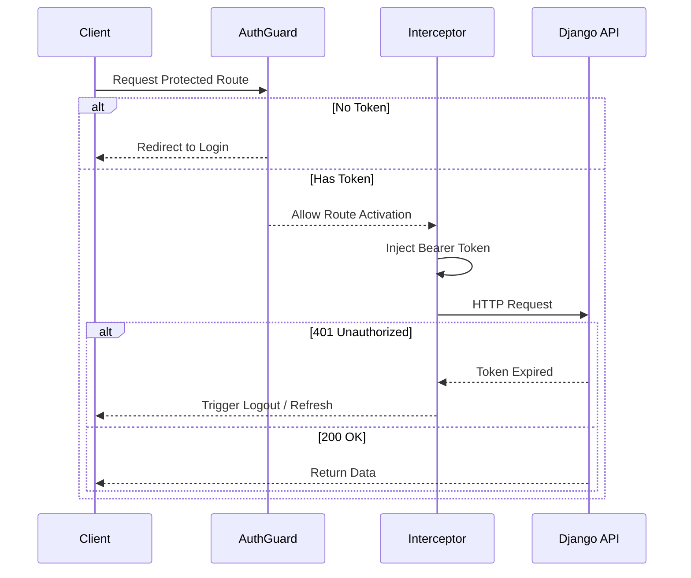
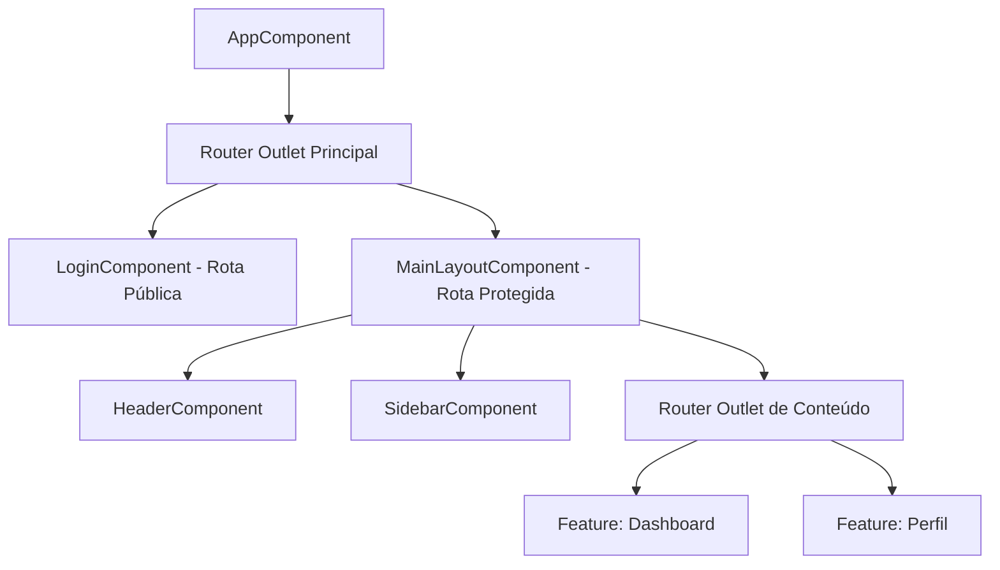

# Arquitetura e Padrões

## 1. Padrão Arquitetural
Este projeto segue uma **Feature-Based Architecture** (Arquitetura Baseada em Funcionalidades) utilizando Angular Standalone Components.
Os padrões tradicionais de `CoreModule` e `SharedModule` estão depreciados em favor de provedores em nível de rota, APIs funcionais e importações independentes.

### Estrutura de Diretórios
- `/core`: Serviços singleton, guards funcionais, interceptors funcionais e modelos globais de domínio.
- `/features`: Módulos independentes e específicos de domínio (ex: auth, dashboard). Cada feature gerencia seu próprio roteamento e estado interno.
- `/layouts`: Componentes estruturais de interface (Sidebar, Header, Main Container).
- `/shared`: Componentes de interface reutilizáveis, pipes e diretivas (estritamente visuais/apresentacionais).

## 2. Gerenciamento de Estado
- **Signals**: Utilizados para todo o estado síncrono da interface e gerenciamento de estado local reativo.
- **RxJS**: Estritamente reservado para operações assíncronas, requisições HTTP e fluxos complexos de eventos.

## 3. Padrões de Documentação (JSDoc / TSDoc)
Todas as APIs públicas (Services, Interceptors, Guards e funções utilitárias complexas) devem ser documentadas usando exclusivamente o padrão JSDoc/TSDoc (`/** ... */`). A documentação deve ser em PT-BR, enquanto nomes de funções e variáveis permanecem em Inglês.

### Regras Rígidas para Comentários
- **Proibição de comentários inline/hardcoded**: É estritamente proibido o uso de comentários de linha (`//`) ou de bloco (`/* */`) no corpo das funções para explicar a execução. O código deve ser autoexplicativo.
- **Apenas JSDoc/TSDoc**: A única forma aceitável de comentário é o bloco JSDoc posicionado acima da declaração.
- **Foco no contrato**: Documente apenas parâmetros (`@param`), retornos (`@returns`) e exceções (`@throws`).
- **Sem Emojis**: O uso de emojis em qualquer documentação ou comentário de código é proibido.

**Exemplo de uso correto:**
```typescript
/**
 * Intercepta requisições HTTP para injetar o token de acesso JWT.
 * Caso receba um erro 401, limpa a sessão e redireciona para o login.
 *
 * @param req - A requisição HTTP de saída.
 * @param next - O próximo interceptor na cadeia.
 * @returns Um Observable do fluxo de eventos HTTP.
 */
```

## 4. Qualidade de Código e Promises
Para garantir a robustez do código e evitar avisos de "floating promises" em IDEs como WebStorm:
- **Operador Void**: Toda Promise cujo retorno não for explicitamente aguardado (`await`) ou retornado deve ser marcada com o operador `void` (ex: `void router.navigate(['/'])`). Isso indica que o desenvolvedor está ciente do retorno assíncrono, mas optou por ignorá-lo.

## 5. Sintaxe de Template e Estilização
Para manter o projeto alinhado com as versões mais recentes do Angular e padrões modernos de CSS:
- **Built-in Control Flow**: É obrigatório o uso da nova sintaxe de controle de fluxo (`@if`, `@for`, `@switch`). O uso de diretivas legadas (`*ngIf`, `*ngFor`) é proibido.
- **Tailwind CSS First**: A estilização deve ser feita prioritariamente através de classes utilitárias do Tailwind no HTML. Arquivos `.css` ou `.scss` de componentes devem ser evitados ou utilizados apenas para seletores complexos (como `:host`) ou animações não cobertas pelo framework.

## 6. Modelagem e Tipagem
Para garantir a limpeza dos arquivos de lógica (`.ts`):
- **Isolamento de Interfaces**: É proibida a definição de interfaces ou tipos dentro dos arquivos de componente.
- **Localização**:
  - Modelos de Domínio (ex: User, AuthResponse): Devem residir em `core/models/`.
  - Modelos de UI/Estruturais (ex: MenuItem, LayoutConfig): Devem residir em `core/models/` com nomenclatura semântica (ex: `layout.model.ts`).

## 7. Estratégia de Componentes de Terceiros
A aplicação adota uma abordagem híbrida e pragmática para componentes de UI:
- **Tailwind CSS (Visual)**: Responsável por 100% do layout, grids, espaçamentos e componentes de UI simples (Buttons, Cards, Badges, Inputs básicos).
- **Angular Material / CDK (Comportamento)**: Reservado exclusivamente para componentes de alta complexidade funcional e acessibilidade, como Datepickers, Modais complexos, Drag-and-Drop ou Virtual Scrolling.
- **Preferência Headless**: Sempre que possível, utiliza-se o Angular CDK para a lógica de comportamento, aplicando a estilização visual via Tailwind.

## 8. Versionamento e Rastreamento
- O histórico do projeto e o rastreamento de versões devem seguir estritamente o formato **Keep a Changelog** em um arquivo `CHANGELOG.md` dedicado.

## 9. Fluxos do Sistema
Fluxos lógicos complexos são documentados usando diagramas **Mermaid** diretamente no Markdown.

### Fluxo de Autenticação


## 10. Estrutura de Layout e Hierarquia de Componentes
### Hierarquia Visual

