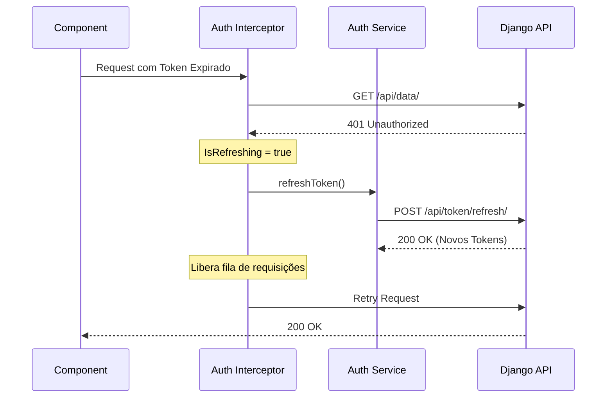
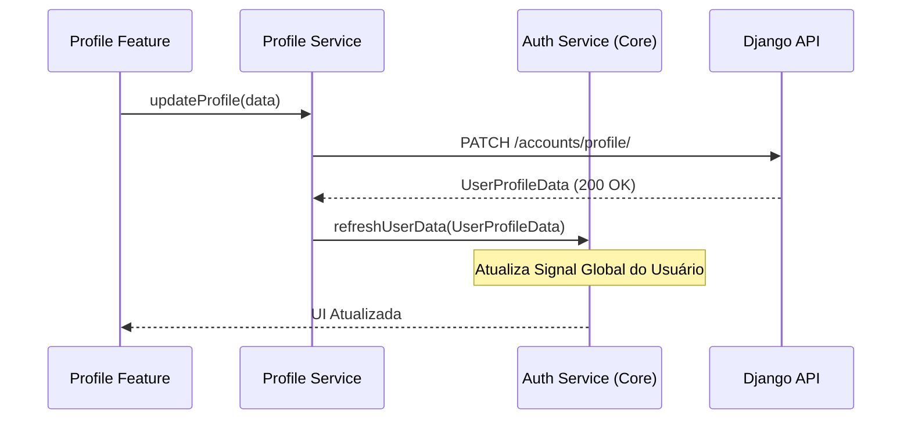
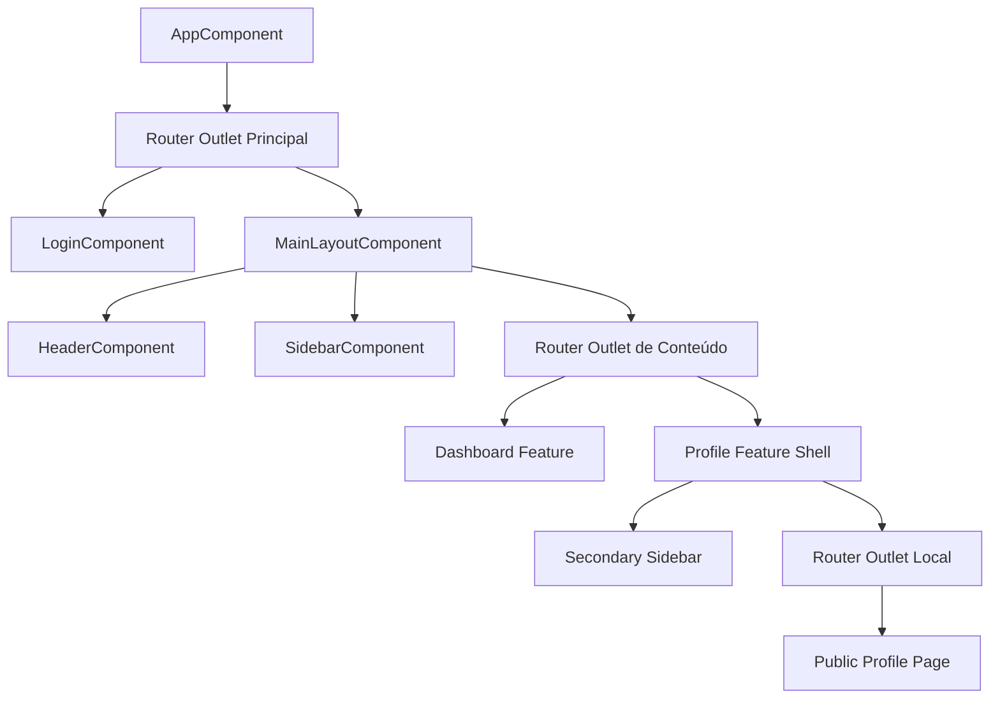

# Arquitetura e Padrões

## 1. Padrão Arquitetural
Este projeto segue uma **Feature-Based Architecture** (Arquitetura Baseada em Funcionalidades) utilizando **Angular Standalone Components**.

O princípio fundamental é o encapsulamento: cada funcionalidade deve ser auto-suficiente, contendo sua própria lógica de interface, roteamento e acesso a dados.

### Estrutura de Diretórios

- `/core`: Serviços singleton globais (Auth, Theme, Interceptors), guards funcionais e modelos de domínio que atravessam todo o sistema.
- `/features`: Módulos independentes por domínio (ex: auth, profile, dashboard). Cada pasta de feature deve conter:
  - `pages/`: Componentes que representam rotas completas ou sub-rotas (Child Routes).
  - `components/`: Componentes internos da funcionalidade.
  - `services/`: Serviços de API (Data Access Layer) específicos da funcionalidade.
  - `models/`: Interfaces e tipos locais.
  - `[feature].routes.ts`: Definições de rota da funcionalidade.
- `/layouts`: Componentes estruturais de interface (Sidebar, Header, Main Container).
- `/shared`: Componentes puramente apresentacionais, pipes e diretivas reutilizáveis sem lógica de negócio.

---

# 2. Gerenciamento de Estado

- **Signals**: Utilizados para todo o estado síncrono da interface e gerenciamento de estado local reativo.
- **RxJS**: Estritamente reservado para operações assíncronas (HTTP) e fluxos complexos de eventos.
- **Estado Global**: Mantido no `/core` via serviços singleton (ex: `AuthService.user()`).  
  Serviços de feature podem atualizar o estado global injetando serviços do core.

---

# 3. Padrões de Documentação (JSDoc / TSDoc)

Todas as APIs públicas (Services, Interceptors, Guards e funções utilitárias complexas) devem ser documentadas usando exclusivamente o padrão **JSDoc/TSDoc (`/** ... */`)**.

A documentação deve ser em **PT-BR**, enquanto nomes de funções e variáveis permanecem em **Inglês**.

### Regras Rígidas para Comentários

- **Proibição de comentários inline/hardcoded**: É proibido o uso de `//` ou `/* */` no corpo das funções para explicar a execução.
- **Apenas JSDoc/TSDoc**: A única forma aceitável de comentário é o bloco JSDoc acima da declaração.
- **Foco no contrato**: Documente parâmetros (`@param`), retornos (`@returns`) e exceções (`@throws`).
- **Sem Emojis**: O uso de emojis em qualquer documentação ou comentário de código é proibido.

---

# 4. Segurança e Autenticação (JWT)

O sistema implementa **Silent Refresh** para manter a sessão ativa de forma transparente, evitando interrupções.

### Mecanismo de Renovação

- **Interceptor**: Detecta erros `401` e pausa requisições subsequentes usando uma fila de espera (`BehaviorSubject`).
- **Renovação**: Executa a chamada de renovação (`/api/token/refresh/`) silenciosamente.
- **Retentativa**: Refaz as requisições originais que falharam após a obtenção do novo token.

---

# 5. Qualidade de Código e Promises

- **Operador `void`**: Toda Promise cujo retorno não for explicitamente aguardado (`await`) deve ser marcada com o operador `void`.

Exemplo:

```ts
void router.navigate(['/dashboard']);
```

---

# 6. Sintaxe de Template e Estilização

- **Built-in Control Flow**: Obrigatório o uso de `@if`, `@for`, `@switch`.
- **Tailwind CSS 4.0 Postfix**: O modificador de importância deve ser utilizado exclusivamente como sufixo (ex: `rounded-xl!`).
- **Shorthands modernos** devem ser preferidos (`shrink-0`, `min-w-45`, etc).
- **Centralização de estilos reutilizáveis**: qualquer padrão visual compartilhado (inputs, botões, alerts, textos, badges de status, ícones) deve ser definido em `src/styles/theme.css` como utilitário (`@layer components`) e consumido apenas via classes utilitárias nos templates.

### 6.1. Tipografia e Hierarquia de Texto

- **Títulos de página (h1/h2)**:
  - Padrão: `text-2xl font-semibold text-heading` (ex.: nome do utilizador em `Profile`).
  - Subtítulos de seção: `text-xl font-semibold text-heading` (ex.: “Perfil Público”).
- **Texto de navegação**:
  - Itens principais (sidebar, navegação secundária): `text-sm font-medium text-muted`.
  - Títulos de grupo na sidebar: `text-[10px] font-semibold text-caption-muted uppercase`.
- **Labels de formulário**:
  - Sempre utilizar `form-label` como base, opcionalmente com `mb-1.5` para espaçamento.
- **Texto auxiliar / descrições**:
  - Utilizar `text-caption-muted` para help-texts e descrições abaixo de campos.
- **Ações destrutivas**:
  - Texto: `text-danger` para botões/links de logout ou remoção.
  - Ícones: `icon-danger` para ícones associados a ações destrutivas.

### Tokens Semânticos

Uso obrigatório das variáveis definidas no `@theme`:

- `primary`: Cores de marca.
- `surface`: Fundos de página.
- `surface-hover`: Fundos para estados de interação (listas/menus).
- `panel`: Fundos de cartões e diálogos.
- `border`: Divisores e contornos.

### Estrutura Visual de Componentes (Padrão GitHub / Flat)

Componentes de interface que representam formulários ou configurações aninhadas devem seguir uma hierarquia visual plana:

- Remoção de sombras pesadas (`shadow-2xl`) em formulários com navegação lateral.
- Alinhamento à esquerda próximo à navegação lateral.
- Divisores visuais simples (`border-t border-border-light`) entre seções.
- Evitar múltiplos **cards aninhados**.

### Comentários de Bloco no HTML

Obrigatório o uso de comentários para separar seções lógicas:

```
<!-- Header -->
<!-- Form Fields -->
<!-- Divider -->
<!-- Actions -->
```

---

# 7. Modelagem e Tipagem

- **Isolamento de Interfaces**: Proibida a definição de interfaces dentro de arquivos `.ts` de componentes.
- **Localização de Modelos**:
  - Modelos globais → `core/models/`
  - Modelos locais → `features/[feature]/models/`

---

# 8. Estratégia de Componentes de Terceiros

- **Tailwind CSS (Visual)**: 100% do layout e componentes simples.
- **Angular Material / CDK (Comportamento)**: Reservado para componentes de alta complexidade (modais, datepickers).
- **Customização**: Overrides repetitivos devem ser centralizados no `theme.css` utilizando tokens de `surface-hover`.

---

# 9. Versionamento

Seguir estritamente o formato **Keep a Changelog** no arquivo `CHANGELOG.md`.

---

# 10. Fluxos do Sistema

## Renovação de Token (Silent Refresh)


```mermaid
sequenceDiagram
    participant UI as Component
    participant Int as Auth Interceptor
    participant Auth as Auth Service
    participant API as Django API

    UI->>Int: Request com Token Expirado
    Int->>API: GET /api/data/
    API-->>Int: 401 Unauthorized

    Note over Int: IsRefreshing = true

    Int->>Auth: refreshToken()
    Auth->>API: POST /api/token/refresh/
    API-->>Auth: 200 OK (Novos Tokens)

    Note over Int: Libera fila de requisições

    Int->>API: Retry Request
    API-->>UI: 200 OK
```

---

## Fluxo de Atualização de Perfil


```mermaid
sequenceDiagram
    participant ProfileFeature as Profile Feature
    participant ProfileService as Profile Service
    participant AuthService as Auth Service (Core)
    participant API as Django API

    ProfileFeature->>ProfileService: updateProfile(data)
    ProfileService->>API: PATCH /accounts/profile/
    API-->>ProfileService: UserProfileData (200 OK)

    ProfileService->>AuthService: refreshUserData(UserProfileData)

    Note over AuthService: Atualiza Signal Global do Usuário

    AuthService-->>ProfileFeature: UI Atualizada
```

---

# 11. Estrutura de Layout e Hierarquia


```mermaid
graph TD

App[AppComponent] --> RO1[Router Outlet Principal]

RO1 --> Login[LoginComponent]
RO1 --> MainLayout[MainLayoutComponent]

MainLayout --> Header[HeaderComponent]
MainLayout --> Sidebar[SidebarComponent]
MainLayout --> RO2[Router Outlet de Conteúdo]

RO2 --> Dashboard[Dashboard Feature]
RO2 --> ProfileShell[Profile Feature Shell]

ProfileShell --> SubNav[Secondary Sidebar]
ProfileShell --> RO3[Router Outlet Local]

RO3 --> Page[Public Profile Page]
```

### Responsividade do Layout

- **Header**: fixo no topo da aplicação.
- **Sidebar**: navegação lateral colapsável, com suporte a overlay em telas pequenas.
- **Main**: área de conteúdo adaptativa com padding responsivo e largura controlada (`max-w-7xl`).

---

# 12. Gestão de Temas

- **ThemeService**: única fonte de verdade utilizando `signal`.
- **Estratégia CSS**: tema aplicado via classe `.dark` no elemento `<html>`.
- **Tokens**: componentes devem utilizar variantes `dark:` vinculadas aos tokens semânticos.

---

# 13. Convenções de Código Angular

## 13.1. Nomes e Organização de Arquivos

- **Components**: `*.component.ts`, `*.component.html`, `*.component.css`.
- **Rotas de feature**: `[feature].routes.ts` exportando `Routes` como **export default**.
- **Services**: `*.service.ts` com sufixo `Service`.
- **Models**: Interfaces em `models/` com nomes em **PascalCase** (`UserProfileUpdate`).
- **Testes**: Arquivos com sufixo `.spec.ts` ao lado do arquivo principal.

## 13.2. Padrão para Rotas

- Rotas raiz definidas em `app.routes.ts` usando **lazy loading** (`loadComponent` / `loadChildren`).
- Cada feature define suas rotas locais em `[feature].routes.ts`, sem declarar rotas diretamente no `app.routes.ts`.
- **Titles de página** devem seguir o padrão: `"Nome da Página | DjangoAdmin"`.

## 13.3. Padrão para Services

- Services de domínio ficam dentro de `features/[feature]/services`.
- Services globais (auth, layout, theme) ficam em `core/services`.
- Todos os métodos públicos que executam chamadas HTTP devem:
  - Retornar **Observables tipados** (`Observable<UserProfileUpdate>`).
  - Utilizar modelos definidos em `models/`.
  - Ser documentados com JSDoc em PT-BR.

## 13.4. Padrão para Components de Feature

- Components de **página** ficam em `pages/` e representam rotas.
- Components **internos** ficam em `components/` e **não** definem rotas diretamente.
- Components de página devem:
  - Injetar services via `inject(...)`.
  - Expor apenas o estado necessário para o template utilizando **signals**.
  - Utilizar templates baseados em `@if` / `@for` para fluxo de controle.

## 13.5. Padrão de Nomenclatura

- **Classes/Interfaces/Types**: `PascalCase` (`MainLayoutComponent`, `UserProfileUpdate`).
- **Variáveis/Funções/Propriedades**: `camelCase` (`isSidebarOpen`, `toggleSidebar`).
- **Signals**: `camelCase` com sufixo contextual (`user`, `isSidebarOpen`).

---

Com este registro, garantimos que qualquer futura feature seguirá as mesmas regras de **arquitetura, design, segurança e convenções de código** aplicadas no projeto.
